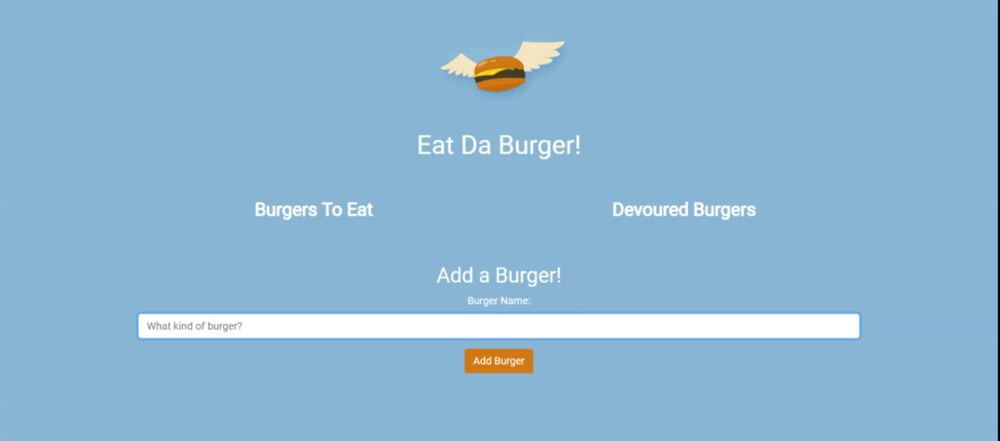

# Eat Da Burger

### Add Burgers and Devour Them!

#### Eat Da Burger allows users to add any type of burger to then devour and delete when they are done!

##### Eat Da Burger is built with MySQL, Node, Express, Handlebars, and a custom ORM. This application also follows the MVC design pattern - using Node and MySQL to query and route the data in the app and Handlebars to generate the HTML.
